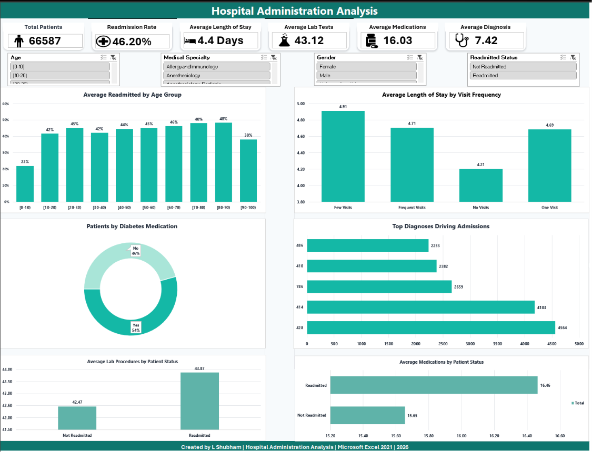

# Hospital-Administration-Analysis
Interactive Hospital Administration Dashboard built in Microsoft Excel using Pivot Tables, Charts, and Slicers for healthcare data analysis.
# 🏥 Hospital Administration Analysis Dashboard

<p align="center">
  
</p>

<p align="center">


</p>

---

# 📌 Project Overview

The **Hospital Administration Analysis Dashboard** is an interactive Microsoft Excel dashboard developed to analyze hospital operations, patient admissions, readmission trends, healthcare resource utilization, and treatment patterns.

The project transforms raw hospital data into meaningful business insights using Excel's advanced analytical capabilities, enabling healthcare administrators to monitor operational performance through interactive dashboards.

---

# 🎯 Project Objectives

- Analyze patient admissions and readmission patterns
- Monitor hospital operational efficiency
- Identify high-risk patient groups
- Evaluate treatment intensity and diagnostic workload
- Build an interactive dashboard using Pivot Tables, Charts, and Slicers
- Present healthcare insights in a clean and professional format

---

# 📂 Repository Structure

```
Hospital-Administration-Analysis
│
├── Dashboard
│   ├── Hospital_Administration_RawData.xlsx
│   └── Hospital_Administration_Dashboard.xlsb
│
├── Dataset
│   └── hospital_administration_data.csv
│
├── Images
│   └── HA_Dashboard.png
│
└── README.md
```

---

# 🛠️ Tools & Technologies

- Microsoft Excel 2021
- Pivot Tables
- Pivot Charts
- Interactive Slicers
- Conditional Formatting
- Excel Functions
- Dashboard Design
- Data Cleaning
- Healthcare Data Analysis

---

# 📊 Dashboard KPIs

The dashboard includes six executive KPIs:

- 👤 Total Patients
- 🔄 Readmission Rate
- 🏥 Average Length of Stay
- 🧪 Average Lab Procedures
- 💊 Average Medications
- 📋 Average Diagnoses

---

# 📈 Dashboard Visualizations

The dashboard includes interactive visualizations such as:

- Readmission by Age Group
- Average Length of Stay by Visit Frequency
- Top 10 Primary Diagnoses
- Readmission by Diabetes Medication
- Readmission by Medication Change
- Average Medications by Readmission Status

All charts are connected with interactive slicers for dynamic filtering.

---

# 🎛️ Interactive Filters

Users can filter the dashboard using:

- Age Group
- Gender
- Medical Specialty
- Readmission Status

---

# 🔍 Key Insights

Some important business insights generated from the analysis include:

- Readmission rates vary significantly across patient demographics.
- Patients with higher visit frequencies generally experience longer hospital stays.
- Certain diagnosis categories account for a substantial share of admissions.
- Medication changes are associated with differences in readmission behavior.
- Healthcare resource utilization differs across patient segments.
- Interactive filtering enables quick departmental and demographic analysis.

---

# 📊 Dashboard Preview

<p align="center">

</p>

---

# 📁 Dashboard Files

| File | Description |
|------|-------------|
| Hospital_Administration_RawData.xlsx | Project overview and raw dataset |
| Hospital_Administration_Dashboard.xlsb | Cleaned dataset, Pivot Tables, Dashboard and Interactive Slicers |

---

# 🚀 Skills Demonstrated

- Data Cleaning
- Data Visualization
- Dashboard Design
- Healthcare Analytics
- Excel Automation
- Pivot Table Analysis
- Business Intelligence
- KPI Development
- Data Storytelling

---

# 💼 About This Project

This project was developed as part of my **Data Analytics Portfolio** to demonstrate practical Excel dashboard development and healthcare data analysis skills.

It showcases the ability to transform raw healthcare data into actionable insights through interactive reporting and professional dashboard design.

---

# 👨‍💻 Author

**L Shubham**

📧 Email: shubham.lingamm@gmail.com

🔗 LinkedIn: https://www.linkedin.com/in/shubham-lingam

💻 GitHub: https://github.com/shubham-lingam

---

## ⭐ If you found this project useful, consider giving it a Star!
